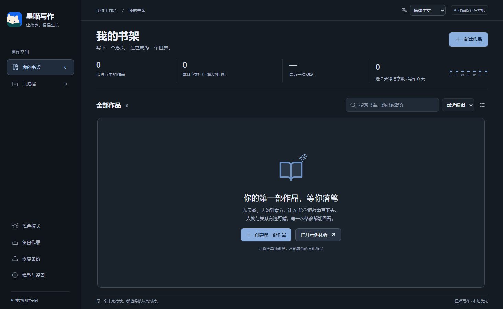
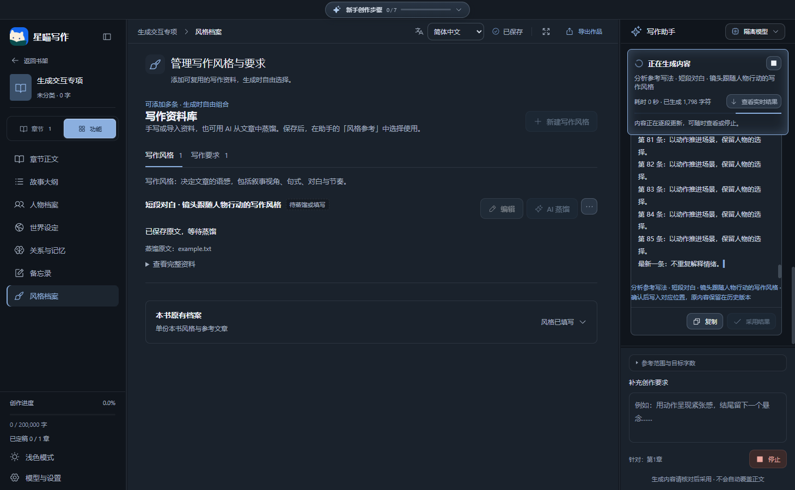

# 星喵写作 · 开源核心版

**会员免费，无需付费开通。** 完整版中的会员与普通用户区分，仅用于方便管理广场提示词库、区分相关权限，不是收费套餐。第三方 AI 模型和生图 API 可能由服务商计费，与免费会员无关。开源核心版不包含账号、会员和广场模块。

本地优先的 AI 长篇小说写作工作台。提供书架、归档和完整的主要写作功能，不需要星喵账号或会员。

**v0.6.8 · Windows x64 · MIT**

把故事总纲、分卷、章节正文、人物、世界设定与来源记忆放在同一个本地工作台。你可以完全手写，也可以接入自己的模型，在预览和审核后采用 AI 候选。

[下载 Windows 安装包](https://github.com/z55902383-debug/xingmiao-writer-core/releases/download/v0.6.8/XingmiaoWriter-Core-0.6.8-x64-Setup.exe) · [完整版](https://github.com/z55902383-debug/xingmiao-writer-releases/releases/tag/v0.6.8)

[English](README.en.md) · [架构说明](docs/architecture.md) · [贡献指南](CONTRIBUTING.md) · [安全说明](SECURITY.md)

[功能说明](docs/features.md) · [路线图与已知限制](docs/roadmap.md) · [上传与发布](docs/GitHub上传步骤.md) · [更新记录](CHANGELOG.md)



## v0.6.8 生成反馈与风格页面优化

- 写作助手顶部常驻真实生成状态：准备资料、等待响应、接收内容、分析变化，显示耗时与已生成字符数
- 生成中增加柔和流光边框、流动细线与旋转图标；支持减少动态效果，完成、停止与失败后结束动画
- 流式内容跟随最新段落，向上阅读自动暂停，可一键恢复；中央生成入口直接定位本次候选，及时刷新模型暂停前的最后一段
- 写作资料库按风格与要求说明用途，标示已选用、可选用或待填写；导出删除收入更多菜单，本书原有档案独立收起

[界面操作说明](docs/生成进度与风格页面说明.md) · [本次检查](docs/检查记录-v0.6.8.md)




## v0.6.7 风格与要求资料库

- 风格档案新增多条写作风格与写作要求，可新建、编辑、删除恢复、导入和导出
- 支持为风格和要求分别导入原文并用 AI 蒸馏，预览后采用到指定条目，保留编辑历史
- 本次参考资料新增风格参考，可分别选择多条风格和要求，仅发送选中内容并保留本次使用记录
- 兼容原本书风格，新增资料随作品 JSON 备份恢复，阻止陈旧结果覆盖新资料

[操作说明](docs/风格与写作要求使用说明.md) · [本次检查](docs/检查记录-v0.6.7.md)

## v0.6.5 人工码字与界面更新

- 人工码字板：临时稿、章节独立草稿、存入作品、冲突恢复、TXT 导出与稿件历史。
- 专注计时、写作目标、查找替换、撤销与字体字号行距；正文排版与 AI 工作台共用规则。
- 灵感助手、作品备忘录、整篇/片段引用；生成讨论与正式正文分开。
- 分组工具栏、可收起侧栏与窄屏适配；分卷父层级、本卷章节与完成状态更清晰。

[人工码字操作说明 ](docs/人工码字板使用说明.md)

## 两种版本

| 功能 | 开源核心版 | 完整软件 |
| --- | --- | --- |
| 人工码字、草稿管理、专注计时、灵感助手、正文排版 | ✓ | ✓ |
| 书架、归档、正文编辑、章节与分卷管理 | ✓ | ✓ |
| 大纲、人物、世界、关系、时间线与资料画布 | ✓ | ✓ |
| AI 写作、候选审核、连续性检查、本地写作 Skill | ✓ | ✓ |
| 自定义模型、中文/英文、深浅主题、本地备份与回收站 | ✓ | ✓ |
| 创意工具箱、生图工具、共享创作广场 | — | ✓ |
| 飞书账号登录、会员服务、内置自动更新 | — | ✓ |

喜欢自行部署、修改代码，可以使用此项目。需要附加服务，可选择维护者提供的完整安装包。两个版本使用独立的数据目录；完整软件的附加功能源码不包含在本仓库中。

## 分步创作流程

想法 → 全文大纲 → 分卷 → 卷大纲/细纲 → 章节大纲/细纲 → 正文 → 完成。逐步生成、核对与采用后，同步卷名、章名及内容，并提示下一步。长规划采用摘要预览，可单独阅读完整内容。

[操作与采用规则](docs/分步创作流程与采用说明.md) · [v0.6.5 检查记录](docs/检查记录-v0.6.5.md)

## 快速开始

需要 Node.js 24、npm，建议使用 Windows 10/11。Electron 首次安装需要下载运行时。

只想使用软件：在本仓库的 **Releases** 页面下载 `XingmiaoWriter-Core-0.6.8-x64-Setup.exe`，不需要安装 Node.js。发布者上传安装包前，Releases 中不会自动出现下载项。

```sh
npm ci
npm start
```

开发模式：`npm run dev`。在“模型与设置”填写你自己的模型接口、模型名和 API 密钥，或连接已安装的官方 Codex。API 使用费用由所选服务商决定。Codex 的官方登录属于模型连接，不是星喵会员账号。

## 检查与构建

```sh
npm run build
npm test
npm run test:ui
```

`test:ui` 使用独立临时书库，不修改真实作品。Windows 打包：`npm run package:win`；只生成可运行目录：`npm run package:dir`。生成物位于 `release/`。

2026-10-09 本地验证：类型检查与构建、123 项业务测试，以及风格资料全流程、原有 AI 写作、完整分步创作和双语桌面检查。模型使用隔离模拟服务。

## 项目结构

```text
.github/          CI 与问题反馈模板
src/              React + TypeScript 界面、双语文案与样式
electron/         主进程、受控 IPC、SQLite、AI 与写作上下文
public/           界面静态资源
build/            打包图标
scripts/          开发和启动入口
tests/            业务测试与桌面回归
docs/             架构、版本边界与数据说明
```

默认书库位于 `%APPDATA%/星喵写作开源版/`，可在设置中更换。正文和资料保存在本机。使用 AI 时，所选正文和上下文会发送给你配置的模型服务；不会调用星喵的飞书、会员或共享广场后端。跨版本迁移请使用作品备份导出/恢复，不直接互换运行中的数据库。

## 许可证

项目采用 [MIT](LICENSE)。第三方依赖保留各自许可证，见 [依赖说明](THIRD_PARTY_NOTICES.md)。项目目录参考常见 Electron/React 开源仓库的组织方式，没有引入参考项目的业务代码。
